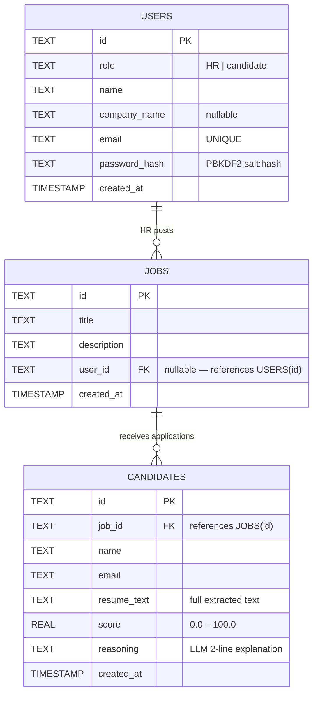

# HireSight — Architecture

## System Overview

```
┌─────────────────────────────────────────────────────────────────────┐
│                        Browser (React SPA)                          │
│                                                                     │
│  /              Landing / RootRedirect                              │
│  /login/:role   AuthPage  ──────────────────────────────────────┐  │
│  /hr/dashboard  HRDashboard  (JWT in localStorage)              │  │
│  /dashboard/:id Dashboard  ──── WebSocket (wss + ?token=JWT) ───┤  │
│  /jobs          JobsBoard  (public)                             │  │
│  /apply/:id     ApplyJob   (public, PDF parsed in browser)      │  │
│  /candidate/…   CandidateDashboard  (JWT in localStorage)       │  │
└─────────────────────────────────────────────────────────────────────┘
              │                              │
              │ HTTPS (fetch, Authorization) │ WSS (?token=)
              ▼                              ▼
┌──────────────────────────────────────────────────────────────────────┐
│                  Cloudflare Worker  (Hono)                           │
│                                                                      │
│  /api/auth/*          → auth.ts    (public)                          │
│  POST /api/jobs       → jobs.ts    (authenticate + requireHR)        │
│  GET  /api/jobs/*     → jobs.ts    (public)                          │
│  POST /api/candidates → candidates.ts (public)                       │
│  GET  /api/candidates/my-applications → (authenticate + requireCand) │
│  GET  /api/leaderboard/:id    → (authenticate + requireHR)           │
│  GET  /api/leaderboard/:id/ws → (inline JWT verify from ?token=)     │
└─────────────┬───────────────────────────────────────┬────────────────┘
              │                                       │
    ┌─────────┼───────────────────────┐   ┌──────────┴──────────┐
    │         │                       │   │   LeaderboardDO      │
    │  D1     │  Workers AI           │   │  (Durable Object)    │
    │  (SQL)  │  bge-base-en-v1.5     │   │                      │
    │         │  llama-3.1-8b-fast    │   │  In-memory sorted    │
    │ jobs    │                       │   │  leaderboard         │
    │ cands   │  Vectorize            │   │  + DO Storage        │
    │ users   │  (768-dim cosine)     │   │  + WebSocket hub     │
    └─────────┴───────────────────────┘   └─────────────────────┘
```

---

## Entity-Relationship Diagram



**Notes on schema design:**

- Primary keys are UUIDs (`TEXT`), not auto-increment integers. This avoids exposing record counts to clients, and is safe across distributed systems.
- `CANDIDATES.email` is not a foreign key to `USERS.email` because anonymous applications (without an account) are allowed. Applications are linked to accounts by email matching inside `GET /api/candidates/my-applications`.
- `JOBS.user_id` is nullable: jobs posted before the auth system was added have no owning user.
- `CANDIDATES.resume_text` stores the full extracted text. A production optimization would move this to R2 object storage and keep only a reference hash in D1.

---

## Auth and Authorization

### Registration and Login

1. A user POSTs `{ name, email, password }` to `/api/auth/register/hr` or `/api/auth/register/candidate`.
2. The Worker generates a random 16-byte salt, then derives a 256-bit key from the password using **PBKDF2-SHA256 with 100,000 iterations**. The result is stored as `"<saltHex>:<hashHex>"` in `users.password_hash`. PBKDF2 with 100 k iterations makes offline brute-force ~100,000× slower than a plain SHA-256 hash.
3. A **HS256 JWT** is returned containing `{ userId, role, exp }`. The token is signed with `JWT_SECRET` (a Wrangler secret, never committed to source). Token lifetime is **24 hours**.
4. The client stores the token in `localStorage` and sends it as `Authorization: Bearer <token>` on every protected request.

### Middleware Chain (server-side)

```
Request
  │
  ├── CORS preflight (/api/*)
  │
  ├── authenticate()          ← reads Authorization header, verifies JWT, sets c.get("user")
  │
  ├── requireHR()             ← asserts c.get("user").role === "HR",  else 403
  │   OR
  │   requireCandidate()      ← asserts c.get("user").role === "candidate", else 403
  │
  └── Route handler
```

### WebSocket Auth Exception

Browser WebSocket connections **cannot send custom headers**. The leaderboard WebSocket at `GET /api/leaderboard/:job_id/ws` therefore accepts the JWT as a `?token=` query parameter and validates it inline before upgrading the connection. This is the standard workaround for the browser WS API limitation.

### Current Auth Surface

| Route | Guard |
|-------|-------|
| `POST /api/jobs` | `authenticate + requireHR` |
| `GET /api/leaderboard/:id` | `authenticate + requireHR` |
| `GET /api/leaderboard/:id/ws` | Inline JWT verify from `?token=`, role must be `HR` |
| `GET /api/candidates/my-applications` | `authenticate + requireCandidate` |
| All other routes | Public |

---

## Non-Obvious Technical Decisions

### 1. One Durable Object Instance per Job (not a shared pub/sub bus)

**Decision:** The leaderboard uses `LEADERBOARD.idFromName(job_id)` — every unique `job_id` maps deterministically to its own Durable Object instance.

**Why:** Multiple HR users can watch the same job's leaderboard simultaneously. They all connect WebSockets to the *same* DO instance (because `idFromName` is deterministic). When a candidate submits, the Worker posts an internal update to that DO, which sorts the leaderboard and broadcasts to all connected WebSocket clients in a single `for...of` loop over `ctx.getWebSockets()`.

A shared Redis pub/sub channel could do the same, but it would require provisioning and managing external infrastructure. The DO approach is zero-infrastructure: it lives inside Cloudflare's network, co-located with the Worker.

**Trade-off:** A single DO instance has one CPU thread and limited memory. At very high scale (thousands of simultaneous WebSocket connections per job), this becomes a bottleneck. The fix would be to shard by region or use a fanout pattern — acceptable complexity for a later version.

---

### 2. Two-Stage AI Scoring (Vectorize → LLM), not One

**Decision:** Resume scoring runs two AI calls in sequence: (a) vector cosine similarity between resume and JD embeddings, then (b) a full LLM prompt.

**Why they do different things:**

| Stage | Model | What it measures | Weakness |
|-------|-------|-----------------|----------|
| Vectorize | `bge-base-en-v1.5` | Semantic overlap — are the same *concepts* present? | Blind to structure, seniority, and reasoning quality |
| LLM | `llama-3.1-8b-instruct-fast` | Holistic match — is this person *actually right* for the role? | Slower, costs tokens, can hallucinate |

The vector score is a cheap, fast signal (and the only score available when Vectorize is offline, e.g., in local dev). The LLM score overrides it when available, because it understands context. A candidate whose resume uses different vocabulary from the JD but describes equivalent experience will score poorly on cosine similarity but well on LLM.

**Trade-off:** Two AI round-trips add latency (typically 2–4 seconds total). A single LLM call with the JD and resume as context would produce similar accuracy but cost more tokens and be slower. The vector stage is cheap enough to justify as a fallback and validation layer.

---

### 3. Browser-Side PDF Parsing (pdfjs-dist), not Server Upload

**Decision:** The candidate's PDF is parsed entirely in the browser using Mozilla PDF.js. Only the extracted plain text is sent to the server.

**Why:**

- **Privacy:** The raw PDF never leaves the candidate's device. Résumés often contain personal information (home address, phone number, photo). Keeping the file client-side is a defensible privacy posture.
- **Bandwidth:** A typical PDF résumé is 200–800 KB. The extracted text is 5–20 KB. The Worker never needs to handle binary uploads, which simplifies the API (standard `application/json` only).
- **Cost:** Cloudflare Workers have a 128 MB request body limit and CPU time limits. Parsing PDFs server-side consumes both. Browser parsing shifts that work to the user's machine where there is no limit.

**Trade-off:** Scanned PDFs (image-only, no embedded text layer) return no extractable text. The app detects this (extracted text length < 50 characters) and shows a clear error message asking for a text-based PDF. Server-side OCR (e.g., via Cloudflare's AI or an external service) is a roadmap item.

---

## Build and Deployment

```
npm run build
  ├── tsc -b          → type-checks all three tsconfigs (app, node, worker)
  └── vite build
        ├── Worker bundle  → dist/hiresight/index.js   (Hono + routes)
        └── Client bundle  → dist/client/              (React SPA + lazy chunks)

npm run deploy
  └── wrangler deploy  → uploads Worker + static assets to Cloudflare
```

The `@cloudflare/vite-plugin` handles the dual-build (Worker + client) in a single Vite invocation and proxies Worker requests during `npm run dev`.
